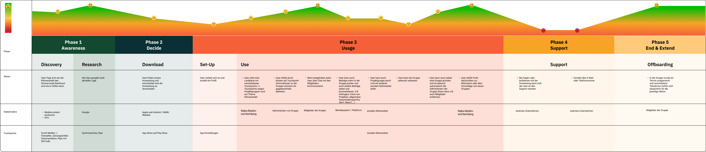

# Time2Klima

## Projekt Beschreibung

Wir wollten eine App entwickeln, welche dem Klimawandel im Schwarzwald entgegenwirken könnte. Dadurch kamen wir auf die Idee für Time2Change. Durch die App können sich die User vernetzen, um Umweltschutzaktionen im Schwarzwald in die Praxis umzusetzen. Sie zeigt eine Landkarte vom Schwarzwald, auf der verschiedene Touchpoints zu sehen sind. Die Touchpoints zeigen Projektgruppen, die sich rund um das Thema Umweltschutz und Nachhaltigkeit in der Region des Schwarzwaldes einsetzen. Der User der App kann sich die verschiedenen Projekte auf der Karte ansehen und schauen, um was sich das Projekt genau handelt und was das Vorhaben ist. Das können dann z.B. Gruppen sein, die sich zu einer Demonstration versammeln wollen, oder zum Säubern eines verschmutzen Waldabschnitts oder auch beispielsweise um Bäume zu pflanzen. Bei Bedarf kann der User einer Gruppe beitreten um selbst aktiv zu werden. Wenn er einer Gruppe beigetreten ist, kann er über einen Chat mit den anderen Teilnehmern kommunizieren und sich austauschen. Er hat auch die Möglichkeit, Beiträge zu verfassen und andere Beiträge zu kommentieren. Außerdem kann der User auch selbst eine Gruppe gründen. Das Ziel der App ist es, dass ein jeweiliges Projekt tatsächlich umgesetzt wird, indem sich die Teilnehmer persönlich treffen. Im weiteren Verlauf der Website zeigen wir Ihnen den unsere Konzeptionsphase und wie wir die App Schritt für Schritt aufgebaut haben. Am Ende befindet sich ein Link für einen High Fidelity Prototyp, welcher die Grundfunktionalitäten der App veranschaulicht.

## Konzeptionsphase

## Low Fidelity Prototyp

Link Low Fidelity Prototyp:

## High Fidelity Prototyp

  

Anmelden                       |  Landkarte                      | Gruppe
:-----------------------------:|:-------------------------------:|:----------------------------:
  |   | 

[Link](url) and 
