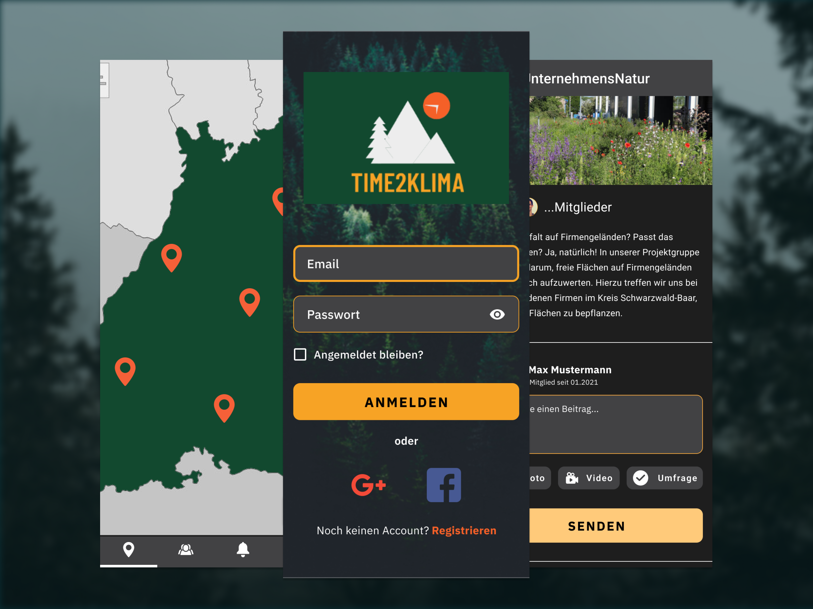
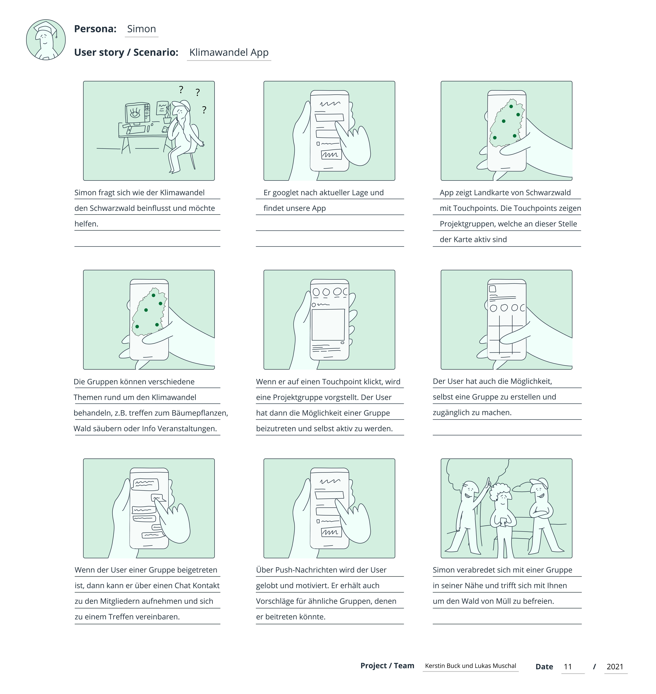
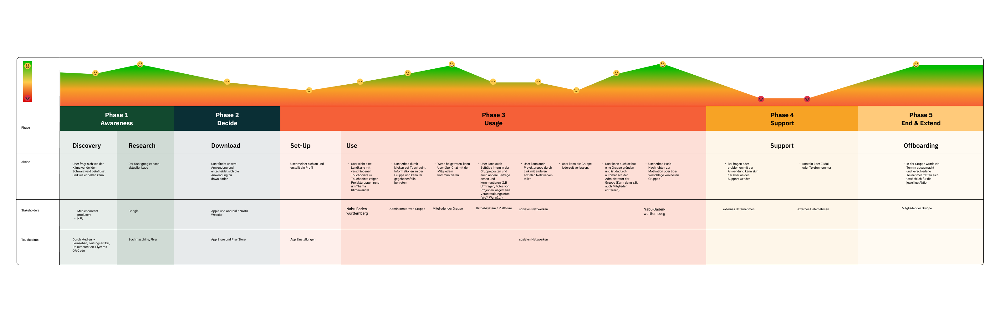
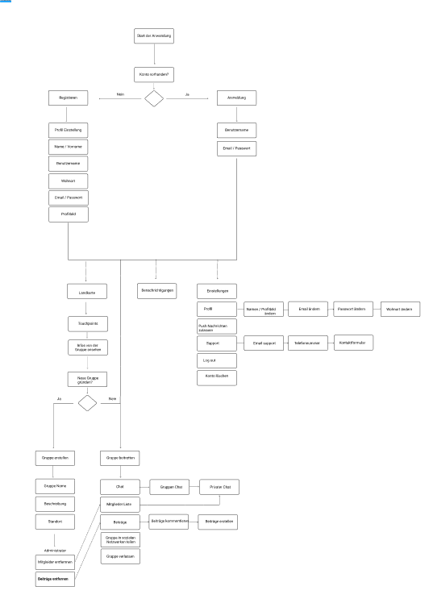
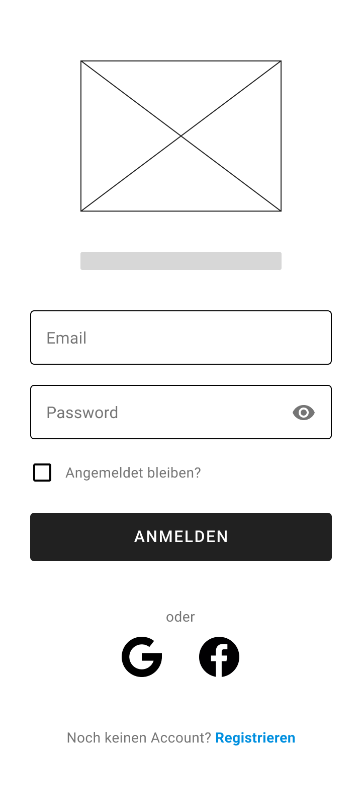
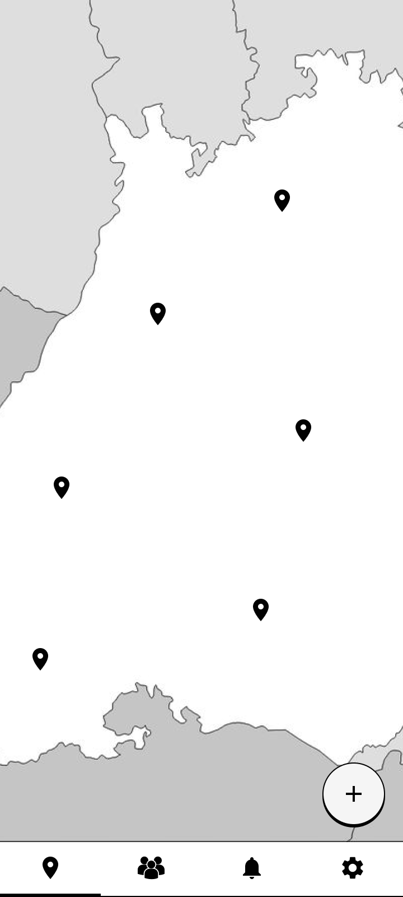
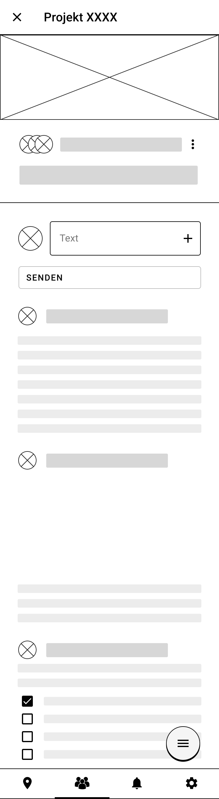
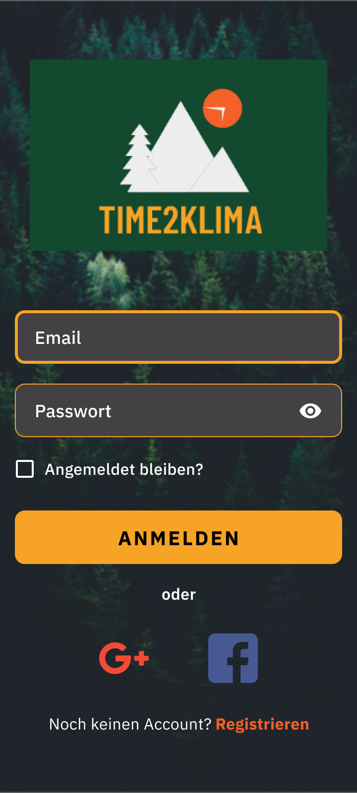
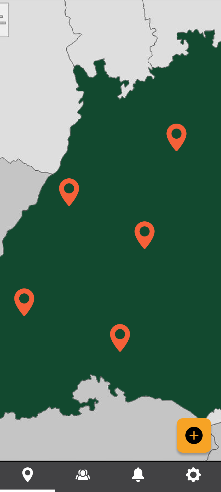
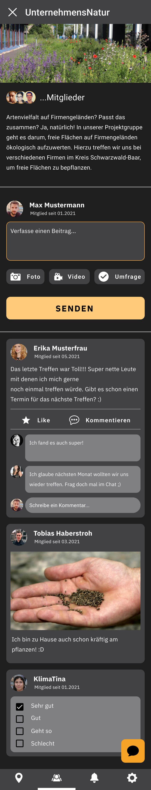

# Time2Klima

## Fragestellung
In dem Studienfach Konzeption haben wir uns mit dem Kurs-Rahmenthema "Klimawandel im Schwarzwald" auseinandersetzten müssen. Hierzu sollten wir ein 2er-Team gründen und im Laufe der Veranstaltung eine Idee entwickeln und umsetzen, welche zu dem Kursthema passt. Dadurch sind wir auf die folgende Idee gekommen.

## Projektbeschreibung

Wir wollten eine App entwickeln, welche dem Klimawandel im Schwarzwald entgegenwirken könnte. Dadurch kamen wir auf die Idee für Time2Klima. Durch die App können sich die User vernetzen, um Umweltschutzaktionen im Schwarzwald in die Praxis umzusetzen. Sie zeigt eine Landkarte vom Schwarzwald, auf der verschiedene Touchpoints zu sehen sind. Die Touchpoints zeigen Projektgruppen, die sich rund um das Thema Umweltschutz und Nachhaltigkeit in der Region des Schwarzwaldes einsetzen. Der User der App kann sich die verschiedenen Projekte auf der Karte ansehen und schauen, um was sich das Projekt genau handelt und was das Vorhaben ist. Das können dann z.B. Gruppen sein, die sich zu einer Demonstration versammeln wollen, oder zum Säubern eines verschmutzen Waldabschnitts oder auch beispielsweise um Bäume zu pflanzen. Bei Bedarf kann der User einer Gruppe beitreten um selbst aktiv zu werden. Wenn er einer Gruppe beigetreten ist, kann er über einen Chat mit den anderen Teilnehmern kommunizieren und sich austauschen. Er hat auch die Möglichkeit, Beiträge zu verfassen und andere Beiträge zu kommentieren. Außerdem kann der User auch selbst eine Gruppe gründen. Das Ziel der App ist es, dass ein jeweiliges Projekt tatsächlich umgesetzt wird, indem sich die Teilnehmer persönlich treffen. Im weiteren Verlauf der Website zeigen wir Ihnen den unsere Konzeptionsphase und wie wir die App Schritt für Schritt aufgebaut haben. Am Ende befindet sich ein Link für einen High Fidelity Prototyp, welcher die Grundfunktionalitäten der App veranschaulicht.

## Ideenfindung
Um eine passende Idee für das Thema zu finden, haben wir uns zunächst persönlich getroffen und im Internet recherchiert, was es alles rund um das Thema "Klimawandel im Schwarzwald" gibt. Dabei ist uns aufgefallen, dass es noch keine App gibt, welche sich mit den Problemen und Auswirkungen von dem Klimawandel im Schwarzwald beschäftigt. Dadurch kam es zu unserer ersten Idee. Wir wollten eine App entwickeln, mit der die Nutzer auf Auswirkungen aufmerksam gemacht werden. Hierzu wollten wir eine Landkarte machen, auf der verschiedene Touchpoints angezeigt werden, bei denen man Bilder und Videos von einer entsprechenden Stelle anschauen könnte und auch selbst Fotos und Videos hochladen kann. Allerdings haben wir nach der ersten Besprechung mit den Professoren unsere Idee wieder verworfen. Auf die Frage, wer unsere App überhaupt nutzen würde und was diese genau bringen soll, konnten wir keine richtige Antwort geben. Dadurch haben wir uns zunächst mit der Zielgruppe beschäftigt und welche Stakeholder mit der App verbunden sein könnten. Wir kamen auf die Idee, dass wir Naturschutz Projekte, wie NABU sie anbietet, in unsere App integrieren könnten. Nach weiterem Nachdenken, was wir anders machen könnten, sind wir dann schließlich auf unsere Idee gestoßen.

### Konzeptionsphase

Als Erstes haben wir ein Storyboard erstellt, um uns einen Überblick zu verschaffen, wie die App grob funktionieren und in den Alltag integriert werden könnte.

Als Nächstes haben wir uns über unsere Zielgruppe Gedanken gemacht. Dadurch wurde uns noch einmal klarer, für wen und warum unsere App interessant sein könnte. Wir haben uns dazu entschieden, dass unsere App an jüngere Leute gerichtet sein soll. 

Die Customer Journey Map hat uns geholfen zu verstehen, aus welchen Bestandteilen unsere App besteht und was wir alles dafür brauchen. Ebenfalls konnten wir dadurch den emotionalen Zustand des Users darstellen, den er beim Nutzen unserer App durchläuft.

Um die Prototypen einfacher planen und bauen zu können, haben wir ein Flow Chart erstellt. Dadurch konnten wir feststellen, aus wie vielen Seiten unsere App bestehen wird und welche Funktionalitäten damit verbunden sind.

## Low Fidelity Prototyp

Als Erstes haben wir eine Low Fidelity Prototyp erstellt, um den groben Aufbau der App darzustellen.
Wir haben den Low Fidelity Prototype mit dem Figma-Tool entwickelt, bei dem alle Teammitglieder gleichzeitig online auf das Dokument zugreifen können. Wir haben das Flow Chart als Grundlage für die Entwicklung der Seiten verwendet und dabei die Reihenfolge der Navigation beachtet. Bei der Erstellung der Seiten haben wir einige Änderungen am Flow Chart vorgenommen, damit die App besser funktioniert.
Der Low-Fidelity-Prototyp wird entwickelt, um eine erste Vorstellung davon zu bekommen, wie die Anwendung aussehen wird und ob ihre Funktionalitäten mit dem zuvor festgelegten Konzept übereinstimmen. Nach der Fertigstellung testen wir den Vorgang, um festzustellen, ob es irgendwelche Fehler oder Navigationsprobleme gibt. Nach den Korrekturen gehen wir zur nächsten Phase der Entwicklung des High Fidelity Prototype über.

Anmelden                                       |  Landkarte                         | Gruppe
:---------------------------------------------:|:----------------------------------:|:-------------------------------------:
  |   | 

Link Low Fidelity Prototyp: [Link](https://www.figma.com/proto/c7HcMhPISbGhoCWDnq5o2c/Konzeption-Phase?node-id=126%3A1963&scaling=min-zoom&page-id=126%3A3&starting-point-node-id=126%3A1963)

## High Fidelity Prototyp

Als letzten Schritt haben wir uns mit dem High Fidelity Prototyp beschäftigt. Als Grundlage diente der alte Prototyp. Durch den High Fidelity Prototyp wird genau gezeigt, wie die App aussieht und wie sie funktioniert.

Anmelden                       |  Landkarte                      | Gruppe
:-----------------------------:|:-------------------------------:|:----------------------------:
  |   | 

